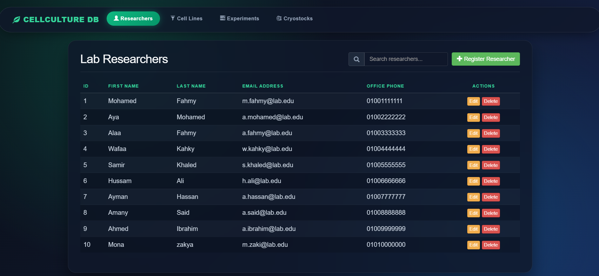

# Cell Culture Laboratory Management Database

## Project overview

This project implements a relational database for managing cell-culture laboratory activities. The database records researchers, cell lines, incubators, culture media, experiments, passages, contamination tests, cryopreserved stocks, and the many-to-many assignment of researchers to experiments.

The design follows the project guidelines for a biotechnology database: it contains more than eight meaningful tables, one associative table for a many-to-many relationship, multiple one-to-many relationships, integrity constraints, two views, a stored procedure, a validation trigger, test data, and varied SQL operations.

## DBMS


```sql
sql/create_tables.sql;
sql/load_data.sql;
sql/views.sql;
sql/triggers_procedures.sql;
sql/queries.sql;
```


## Repository structure

| Path | 
|---|
| `sql/create_tables.sql` | 
| `sql/load_data.sql` | 
| `sql/views.sql` |
| `sql/triggers_procedures.sql` | 
| `sql/queries.sql` | 
| `diagrams/ERD.png` | 
| `report.docx` | 
| `presentation.pptx` |
| `src/PROJECT.py` |
| `src/templates/cell_lines` |
| `src/templates/cryostocks` |
| `src/templates/experiments` |
| `src/templates/header` |
| `src/templates/researchers` |
| `src/static` |


### Web Application


