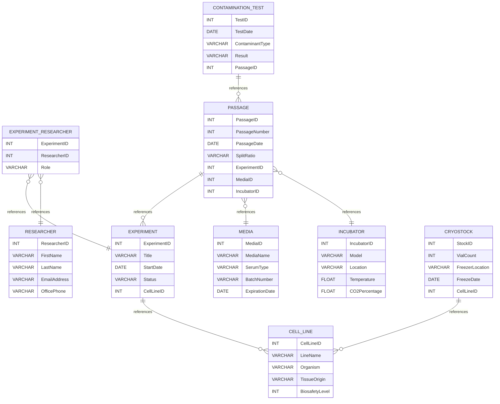

# Cell Culture Project
## Student name: Merna Mikhaiel

## Overview
This project implements the `Cell Culture Database`. The project consists of three docker containers that can be started using `docker compose`:  
- **MySQL database server**: which is exposed on port 3306.
- **Adminer Web interface**: for management of the MySQL server. Exposed on port 8080.
- **DrawDB**: A web server for visualizing the database sql schema and drawing an ERD diagram. Exposted on port 3000


## Project Setup
- Install Docker Desktop (Which includes docker-compose).  
  [Windows Installation Instructions](https://docs.docker.com/desktop/setup/install/windows-install/)  
  [Linux Installation Instructions](https://docs.docker.com/desktop/setup/install/linux/)   

- Clone the repository locally:  
  ```bash
  git clone https://github.com/mohramikheal-code/database-cell-culture.git
  ```
- Create `.env` file that contains the environment variables. This is a sample of a `.env` file:  

  ```env
  # Database Credentials Configuration
  DB_ROOT_PASSWORD=merna
  DB_NAME=CellCultureDB
  DB_USER=merna
  DB_PASSWORD=merna
  ```
- Run docker compose to start the containers.  
  ```bash
  docker compose up
  ```

   Docker compose automatically creates the database and executes the database scripts inside [sql](./sql) directory in the following order:
  - [sql/01-create_tables.sql](sql/01-create_tables.sql): Creates the database and the tables.
  - [sql/02-load_data.sql](sql/02-load_data.sql): Loads the sample data into the database.
  - [sql/03-views.sql](sql/03-views.sql): Creates views.
  - [sql/04-triggers_procedures.sql](sql/04-triggers_procedures.sql): Creates stored procedures and triggers.

- Access the servers:  
  * **Adminer**:  <localhost:8080>
  * **DrawDB**:  <localhost:3000>
  * **MySQL Server**:  
    Open a bash shell and execute the commmands to drop into `mysql` client:  
    ```bash
    docker compose exec db bash
    mysql -u root -p
    ```


## Database Diagram
### Mermaid Diagram


### MySQL Workbench ERD output

